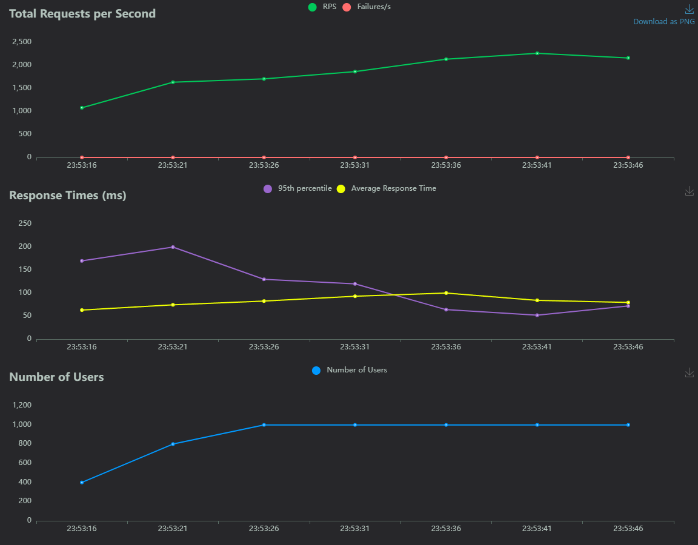
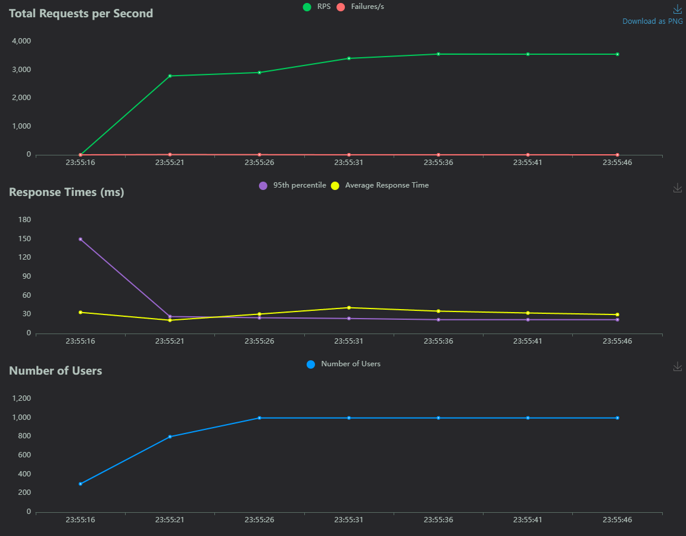

# 백엔드 사전과제 (이진석)

## 🏠 Overview

**소감**

레진코믹스 백엔드 사전과제로 rest api를 개발하였다.

구현 범위는 요구사항 전체를 구현하였고 짧은 시간 프로젝트를 만들면서 스스로에게 좋은 배움의 기회가 된거같다! <br><br>

**요구사항 만족**

요구사항에 맞게 작동하는것이 중요하다고 생각이 들었다.

그래서 기능 요구사항을 면밀히 검토하여 제대로 작동하는 api를 만드는 것을 최우선으로 삼았다. <br><br>


**테스트 가능**

테스트 코드를 작성하여 신뢰도있는 프로젝트를 만들고자 하였다

컨트롤러 테스트, 비지니스 로직 테스트, DB 테스트를 아울러 테스트 코드를 작성하였다.<br><br>

**가독성**

변수명이나 메소드명, 클래스명등 명명 규칙을 가독성있고 이해하기 쉬운 이름을 붙이려고 노력하였다.<br><br>

**멀티 모듈**

프로젝트 모듈을 core와 api로 나누어 느슨하게 결합되도록 의도하였다.<br><br>

**예외 처리**

예외처리를 적절하게 하여 api에서 해당 예외에 맞는 응답을 줄 수 있도록 advice controller를 활용하였다.<br><br>

**데이터**

java진영의 ORM인 jpa, querydsl을 사용하였다. DB는 로컬테스트가 용이하도록 h2를 사용하였다. 다만 분산락을 사용하기 위해서는 h2로 한계가 있어 mysql docker-compose.yml을 작성해두었고 어플리케이션을 구동시킬때 prod profile을 추가시키면 mysql 서버에 접속하도록 하였다.
<br><br>

**swagger**

swagger를 적용하여 api를 보기 좋게 만들었다.

## 🏛️ Structure

### Api

> application 레이어와 presentation 레이어로 두가지로 나누어서 관심사를 분리시켰다.

**domain**

- Comic
- ComicMemberRate
- ComicViewHistory
- Member
- Auth


### Core

> 어플리케이션에 필요한 DB 관련 설정을 제공하는 모듈 (core)

**domain**
- Comic
- ComicMemberRate
- ComicViewHistory
- Member
- Auth

## 🎢 Tech Stack

- java 17
- gradle 8.6
- spring boot 3.2.3
- h2
- jpa
- querydsl
- junit5
- lombok
- swagger
- docker

## 성능 테스트 (locust)

### 좋아요가 가장 많은 작품 3개 성능 테스트 

run: load-test/docker-compose.yml 빌드

url: /api/v1/comics/top-three-by-likes

**No Cache**




| RPS  | Average Response Time | Failures |
|------|-----------------------|----------|
| 2090 | 79ms                  | 0        |


**With Cache**



| RPS  | Average Response Time | Failures |
|------|-----------------------|----------|
| 3556 | 30ms                  | 0        |


## Swagger 

주소: http://localhost:8080/swagger-ui/index.html


## 🏃 Run Application

테스트 실행

```shell
chmod +x test.sh
./test.sh
```

build파일 삭제

```shell
chmod +x clean.sh
./clean.sh
```

어플리케이션 실행

```shell
chmod +x start.sh
./start.sh
```

## 👷 TODO

- [x] 회원가입 api
- [x] 로그인 api
- [x] 평가 api
- [x] 좋아요가 가장많은 작품 3개, 싫어요가 가장많은 작품 3개 조회 api
- [x] 작품별로 언제, 어떤 사용자가 조회했는지에 대한 이력을 조회하는 api
    - [x] 웹툰 조회 api
    - [x] 웹툰 조회 이력 api
- [x] 최근 1주일간 등록 사용자 중 성인 작품을 3개 이상 조회한 사용자 목록을 조회하는 api
    - [x] repository 작성
    - [x] repository test 코드작성
    - [x] service 작성
    - [x] service test 코드작성
    - [x] controller 작성
    - [x] controller 테스트 코드 작성
- [x] 특정 작품을 유료, 무료로 변경하는 api
    - [x] service 작성
    - [x] service 테스트
    - [x] controller 작성
    - [x] controller 테스트 코드 작성
- [x] 특정 사용자 삭제 api
    - [x] service 작성
    - [x] service 테스트 코드 작성
    - [x] controller 작성
    - [x] controller 테스트코드 작성
- [ ] 웹툰 등록
  - [x] 웹툰 등록 api
  - [ ] 웹툰 등록 api test
  - [x] 웹툰 등록 service
  - [ ] 웹툰 등록 service test
- [ ] 작가 등록
  - [x] 작가 등록 api
  - [ ] 작가 등록 api test
  - [x] 작가 등록 service 
  - [ ] 작가 등록 service test
- [x] 기타
    - [x] swagger 정리
    - [x] 평가 작성 > 댓글 특수문자 방지
    - [x] 유료 변경시 100~500원 사이로만 가능하게
    - [x] README 작성
    - [x] 성능테스트